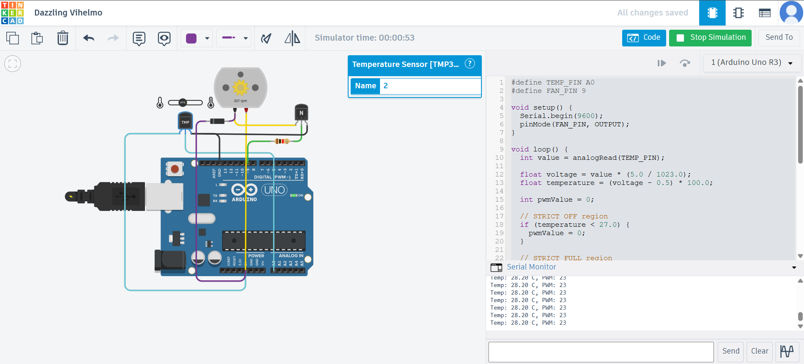
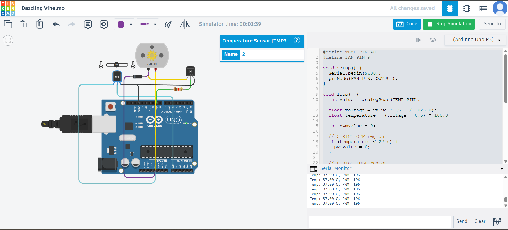
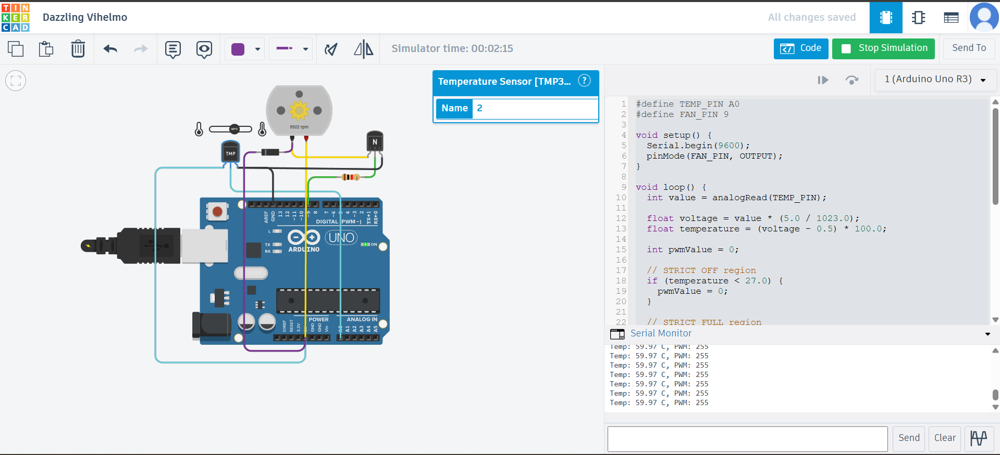
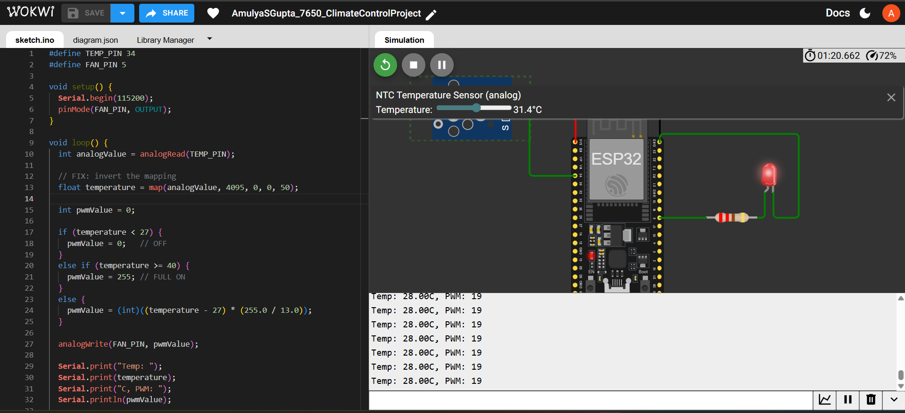
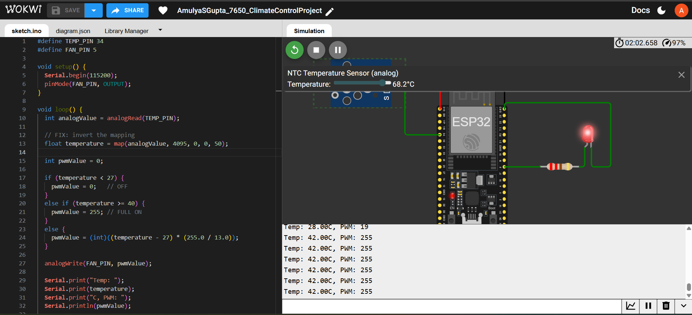

# 🌡️ Climate Control System using Arduino & ESP32

## 📌 Overview

This project implements a **temperature-based climate control system** that automatically adjusts fan speed using PWM (Pulse Width Modulation). The system continuously monitors temperature and dynamically controls output devices for efficient cooling.

The project is developed and tested on two platforms:

* 🔹 **Tinkercad** using Arduino UNO and TMP36 sensor
* 🔹 **Wokwi** using ESP32 and NTC temperature sensor

---

## ⚙️ Features

* 🌡️ Real-time temperature monitoring
* 🌀 Automatic fan speed control
* 📈 Linear PWM-based speed variation
* 🔴 LED indication (ESP32 simulation)
* 🔄 Continuous system operation
* 🔬 Dual-platform simulation (Wokwi + Tinkercad)

---

## 🛠️ Components Used

### 🔹 Tinkercad Setup

* Arduino UNO
* TMP36 Temperature Sensor
* DC Motor (Fan)
* NPN Transistor
* Resistor

### 🔹 Wokwi Setup

* ESP32
* NTC Temperature Sensor (Analog)
* LED (Fan simulation using PWM)

---

## 🚀 Working Principle

The system reads temperature values and controls fan speed based on predefined thresholds:

* **Temperature < 27°C**
  ➝ Fan OFF

* **Temperature between 27°C and 40°C**
  ➝ Fan speed increases gradually using PWM

* **Temperature ≥ 40°C**
  ➝ Fan runs at maximum speed

This ensures smooth and efficient cooling instead of abrupt ON/OFF behavior.

---

## 🔢 Control Logic

* PWM range: **0 – 255**
* Linear mapping applied between **27°C and 40°C**
* Higher temperature → Higher fan speed

---

## 📂 Project Structure

```
├── code/
│   ├── arduino_uno.ino
│   ├── esp32.ino
│
├── tinkercad/
│   ├── output1.png
│   ├── output2.png
│   ├── output3.png
│
├── wokwi/
│   ├── output1.png
│   ├── output2.png
│   ├── output3.png
│
├── circuit_diagram.png
├── flowchart.png
├── README.md
```

---

## 📸 Outputs

### 🔹 Tinkercad Simulation





### 🔹 Wokwi Simulation





---

## 🔬 Simulation Comparison

| Feature      | Tinkercad (Arduino UNO) | Wokwi (ESP32)           |
| ------------ | ----------------------- | ----------------------- |
| Sensor Type  | TMP36                   | NTC Sensor              |
| ADC Range    | 0–1023                  | 0–4095                  |
| Output       | Motor (Fan)             | LED (PWM)               |
| Platform Use | Beginner-friendly       | Advanced IoT simulation |

---

## 📌 Key Learning

* Analog sensor interfacing
* Temperature conversion techniques
* PWM-based control systems
* Linear mapping of sensor values
* Embedded system design
* Simulation across multiple platforms

---

## 🔗 Simulation Links

* Wokwi: https://wokwi.com/projects/459192550195713025
* Tinkercad: https://www.tinkercad.com/things/hkvF21YMmgX-dazzling-vihelmo/editel?returnTo=https%3A%2F%2Fwww.tinkercad.com%2Fdashboard%2Fdesigns%2Fall&sharecode=DS_ccpC2l4keYI7ObBjmtDvs8ULfbRJfgZJxTvnHBec

---

## 👩‍💻 Author

**Amulya S Gupta**
